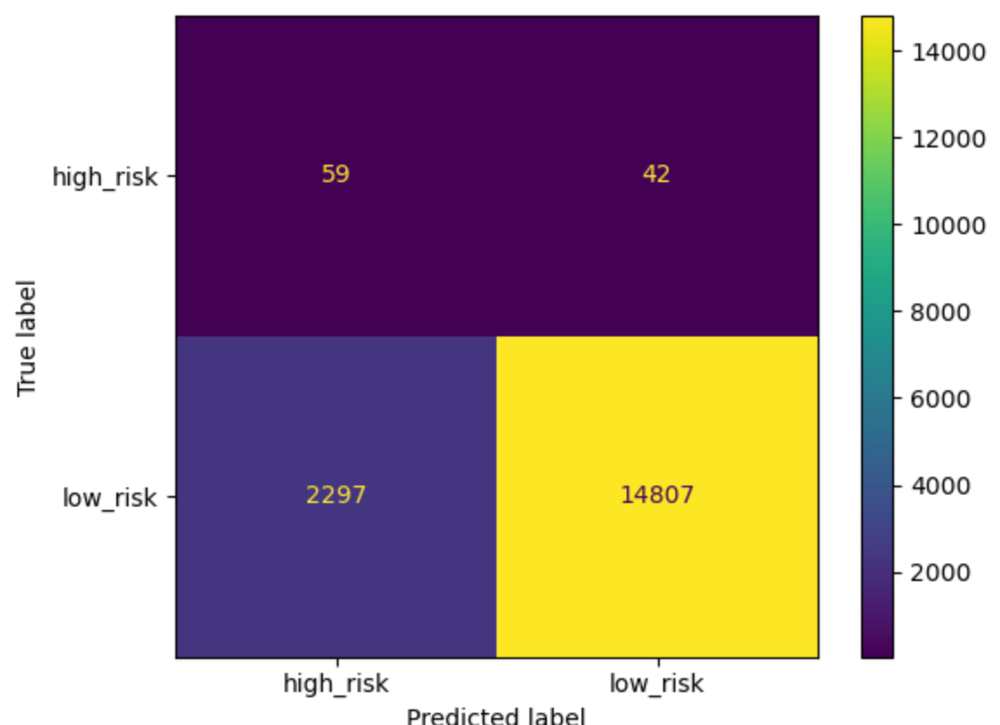
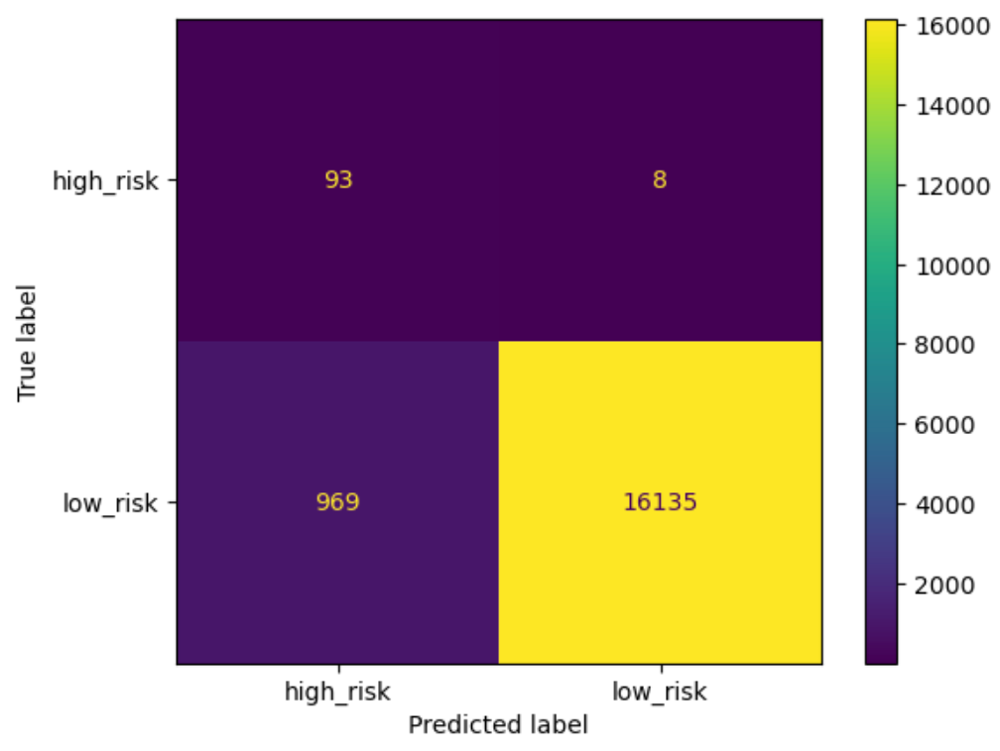
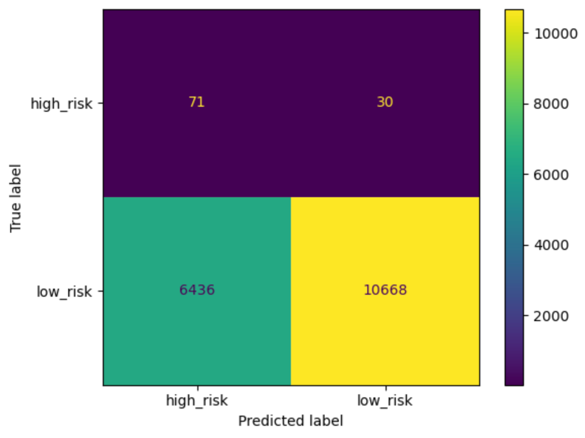
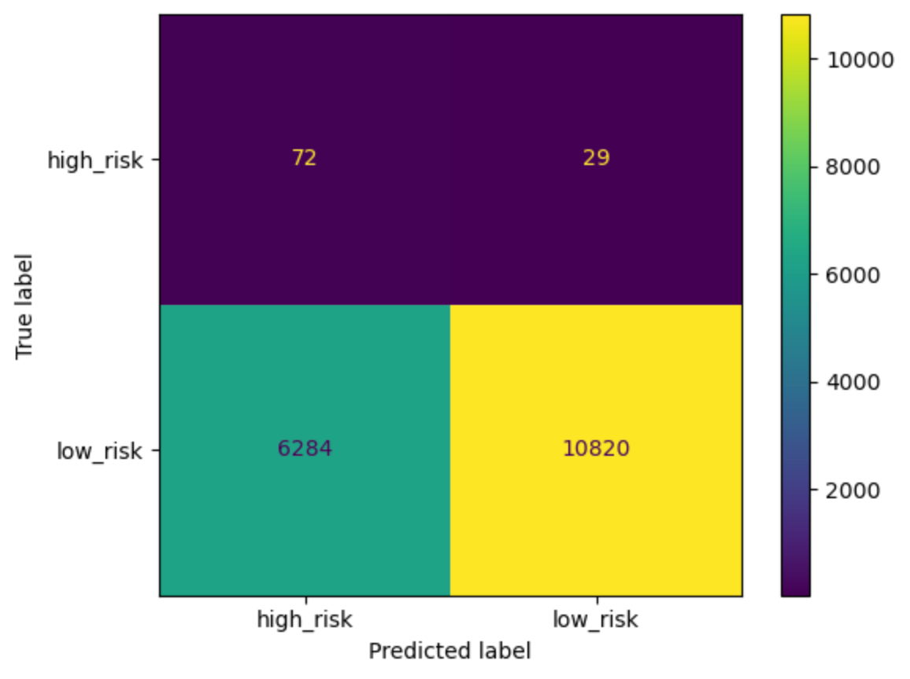
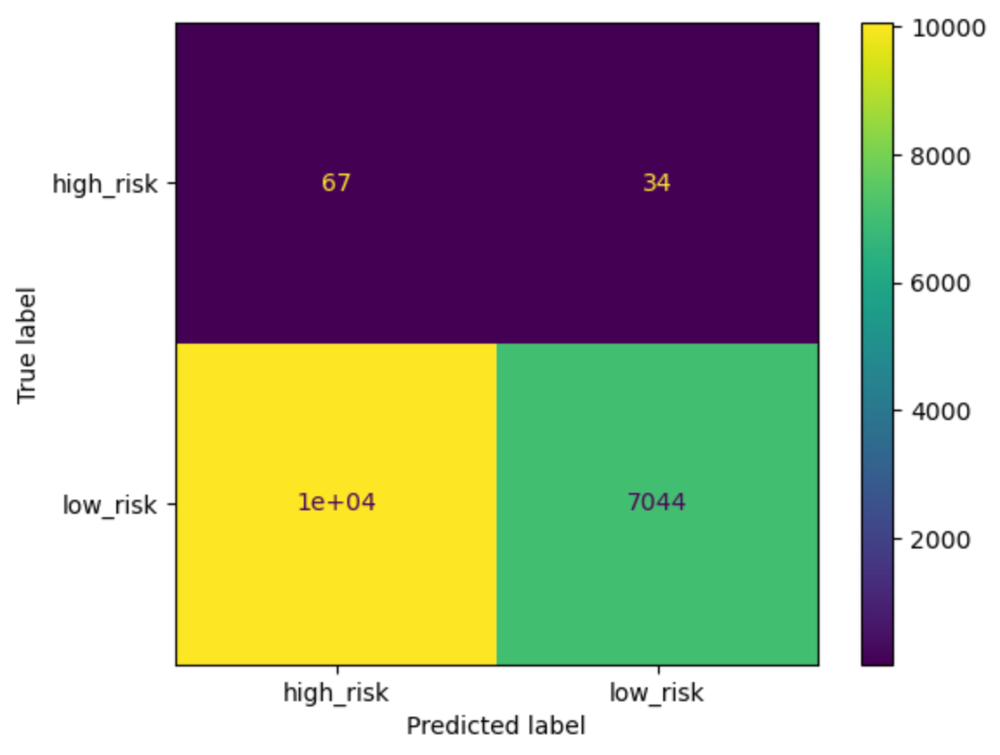
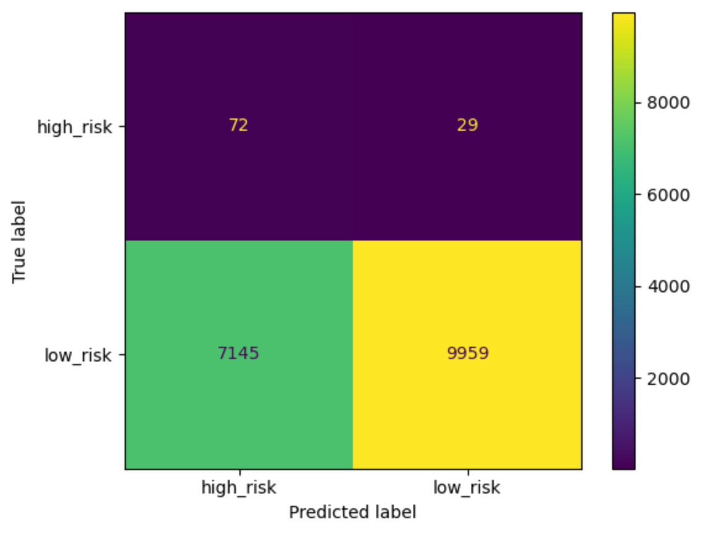

# Credit Risk Analysis
#### Scott Saenz

## **Overview**
Credit risk analysis is used to determine which loans are at high-risk of defaulting. This is important for financial institutions because they make money off of the interest for loans, but lose money when a loan defaults. Identifying loans that are high risk of defaulting enables a bank to reach out to those customers and see if there are steps that can be taken to keep the account current.
## **Results**
Two main types of analysis was conducted to determine if a loan is high risk or not, Ensemble Learners, which aggregate many small models to create a more significant model, and Resampling, which resamples the data so that the training set has about an equal chance of the different outcomes. This is used when there is a large difference between the two outcomes (high-risk and low-risk in this case).
### Ensemble Learners
#### Balanced Random Forest Classifier
Accuracy of 72.5%

Confusion Matrix
A confusion matrix can be visuallized using the following code
```python
from sklearn.metrics import confusion_matrix, ConfusionMatrixDisplay
cm = confusion_matrix(y_test, y_pred, labels = model.classes_)
disp = ConfusionMatrixDisplay(confusion_matrix=cm,
                               display_labels=model.classes_)
disp.plot()
```




Classification Report Imbalanced
| | pre |      rec   |    spe  |      f1   |    geo  |     iba  |     sup |
|---|---|------------|---------|-----------|---------|----------|---------|
|  high_risk |      0.03 |     0.58 |     0.87 |     0.05 |     0.71 |     0.49 |      101 |
| low_risk |      1.00 |     0.87 |     0.58 |     0.93 |     0.71 |     0.52 |    17104|
| | | | | | | |
| avg / total |       0.99  |    0.86 |     0.59 |     0.92 |     0.71 |     0.52 |    17205 |

Most Signicant Features 
(0.07593900705995023, 'total_rec_prncp'), 
(0.06158702510225812, 'last_pymnt_amnt'), 
(0.05971837741050125, 'total_pymnt_inv'),
(0.05636801158522087, 'total_rec_int'),
(0.053249264619626695, 'total_pymnt')


#### Easy Ensemble AdaBoost Classifier
Accuracy of 93.2%

Confusion Matrix


Classification Report Imbalanced
| | pre |      rec |      spe |       f1  |     geo | iba |      sup |
|---|---|----------|----------|-----------|---------|-----|----------|
|  high_risk |      0.09  |    0.92 |     0.94 |     0.16 |     0.93  |    0.87 |      101 |
|   low_risk |      1.00 |     0.94 |     0.92 |     0.97 |     0.93  |    0.87 |     17104 |
|          | | | | | | | |
| avg / total |       0.99 |      0.94 |     0.92 |     0.97 |     0.93  |    0.87  |   17205

### Resampling
#### Naive Random Oversampling
Accuracy 65.1%



Classification Report Imbalanced

| |pre |      rec |      spe |        f1 |      geo |      iba |      sup |
|---|---|---------|----------|-----------|----------|----------|----------|
|  high_risk |      0.01 |     0.70 |     0.60 |     0.02 |     0.65 |     0.43 |      101
|   low_risk |      1.00 |     0.60   |   0.70 |     0.75  |    0.65 |     0.42 |    17104
|          | | | | | | | |
|avg / total |      0.99 |     0.60  |    0.70 |     0.74 |     0.65 |     0.42 |    17205


#### SMOTE Oversampling
Accuracy 67.3%

Confusion Matrix


Classification Report Imbalanced

| |pre |  rec | spe |   f1  |  geo | iba | sup |
|---|---|-----|-----|-------|------|-----|-----|
|high_risk |      0.01 |  0.71 | 0.63 | 0.02 | 0.67 | 0.45  | 101
|low_risk | 1.00 |  0.63 | 0.71 | 0.77  |    0.67 |     0.45 |    17104
|          | | | | | | | |
|avg / total |      0.99 |     0.63  |    0.71 |     0.77  |    0.67 |     0.45  |   17205


#### **Undersampling**
Accuracy 53.8%

Confusion Matrix


Classification Report Imbalanced
| |pre|       rec  | spe | f1 |   geo | iba  | sup |
|---|---|----------|-----|----|-------|------|-----|
|  high_risk  |     0.01  | 0.66 |  0.41 |  0.01  | 0.52 | 0.28 | 101|
|low_risk| 1.00 |     0.41   |   0.66  |    0.58 |     0.52  |    0.27  |   17104 |
|          | | | | | | | |
|avg | total  |     0.99  |    0.41  |    0.66  |    0.58    |  0.52   |   0.27  |   17205


#### **Combination Over/Under Sampling**
Accuracy 64.8%

Confusion Matrix


| | pre |      rec |      spe  |      f1  |     geo |      iba  |     sup |
|---|---|---|---|---|---|---|---|
|high_risk |      0.01 |     0.71 |     0.58 |     0.02 |     0.64 |     0.42 |      101|
|   low_risk |      1.00 |     0.58   |   0.71 |     0.74 |     0.64 |     0.41   |  17104
|          | | | | | | | |
|avg / total |      0.99 |     0.58 |     0.71  |    0.73 |     0.64 |     0.41 |    17205 |


## **Summary**

---
[Environment Configuration Ensemble Notebook](environment.yml)<p>
[Environment Configuration Resampling Notebook](resampling_env.yml)
