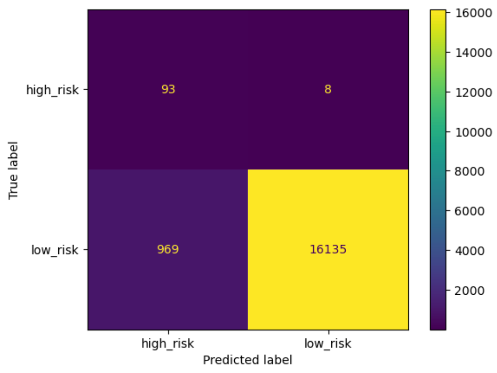

# Credit Risk Analysis
#### Scott Saenz

## **Overview**
Credit risk analysis is used to determine which loans are at high-risk of defaulting. This is important for financial institutions because they make money off of the interest for loans, but lose money when a loan defaults. Identifying loans that are high risk of defaulting enables a bank to reach out to those customers and see if there are steps that can be taken to keep the account current.
## **Results**
Two main types of analysis was conducted to determine if a loan is high risk or not, Ensemble Learners, which aggregate many small models to create a more significant model, and Resampling, which resamples the data so that the training set has about an equal chance of the different outcomes. This is used when there is a large difference between the two outcomes (high-risk and low-risk in this case).
### Ensemble Learners
#### Balanced Random Forest Classifier
Accuracy of 93.2%

#### Easy Ensemble AdaBoost Classifier
### Resampling
#### Naive Random Oversampling
#### SMOTE Oversampling
#### Undersampling
#### Combination Over/Under Sampling 
## **Summary**
